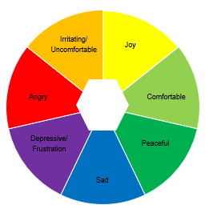
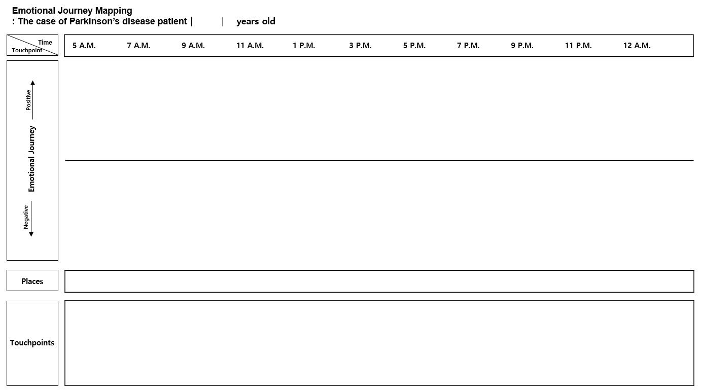
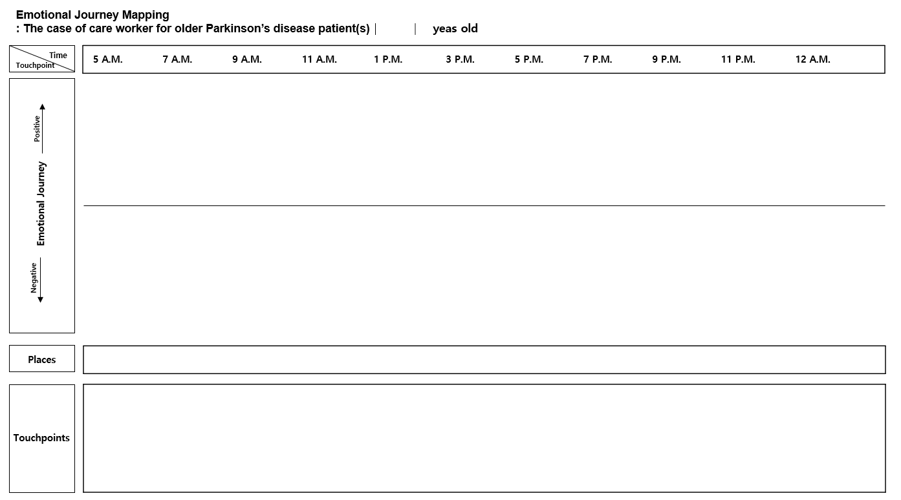

# Dr. Nari Kim, Ph.D.

### Geographer of Care, Aging, and Justice

ORCID: [0000-0003-1455-3549](https://orcid.org/0000-0003-1455-3549) · Email: [anjelra1211@gmail.com](mailto:anjelra1211@gmail.com)

**Jump to:** [About](#about) · [Diversity, Equity & Inclusion](#diversity-equity--inclusion) · [Research](#research) · [Education](#education) · [Publications](#publications) · [Conference Presentations](#conference-presentations) · [Teaching](#teaching) · [Awards](#awards--fellowships) · [Service](#service) · [Contact](#contact)

---

## About

I am a critical geographer whose work examines dignity, justice, and exclusion across the spaces of aging, disability, and care. I study how society "produces" old and sick bodies, and how care workers and care receivers navigate political, emotional, and spatial structures that too often marginalize them. Drawing on bio-politics, feminist ethics of care, and critical geopolitics, my scholarship sits squarely within questions of equity and inclusion — from theorizing eldercare justice and ageism, to my very first research project as an undergraduate, on the spatial exclusion of the visually impaired from a public square in Seoul.

I hold a Ph.D. in Geography from the University of Delaware (2017–2023), advised by [Julie Klinger](https://www.udel.edu/academics/colleges/ceoe/departments/gss/faculty/julie-klinger/), and was a member of the [Embodiment Lab](https://sites.udel.edu/geog-bodylab/), co-facilitated by [Lindsay Naylor](https://sites.udel.edu/lnaylor/) and [Paul Jackson](https://udel.academia.edu/PaulJackson).

**Research Interests:** History of Justice · Isolation · Visualizing Emotion · Later-life Care · Aging-in-Place · Eldercare Justice · Dignity · Bio-power · Bio-politics · Sovereignty & Bare Life · Alienation

---

## Diversity, Equity & Inclusion

*Adapted from my own diversity statement.*

Diversity necessarily means different things to different people, and has different meanings in different contexts — diversity, in other words, is a spatial practice. In matters related to diversity, spatial exclusions and disparities are common between dominant and underprivileged groups. I interpret diversity issues through the framework of **care** and an **ethic of care**, because "care" respects the status, attitude, and culture of others instead of asking about nationality, race, sexual orientation, or disability — and because practicing care forces us to attend to the most sensitive aspects of a person's situation, like emotion, instead of excluding or judging people based on generalized assumptions.

As a Korean woman and international scholar, my own understanding of diversity is shaped by my experience navigating both Korean society — historically racially homogeneous, but stratified by wealth, occupational class, and gender — and U.S. academia, where I have observed how institutions can treat international students and scholars as a revenue source while under-investing in the substance of the "diversity" they promote.

My research, teaching, and public engagement navigate these facets of diversity under a pursuit of **dignity**. As a human geographer, I weave social responsibility into theoretical work and spatial analysis — most directly through my research on **ageism** and **ableism**, which I see as part of a broader set of diversity issues. Using a care lens, I try to make visible both the obvious and the not-so-obvious inequalities experienced by eldercare beneficiaries and providers alike. I believe the fundamental problem in a lot of "diversity" work is a lack of care for the people the work claims to serve — which is why I argue for centering dignity, not just categories, in how we think about equity and inclusion.

---

## Research

### Earlier Research — Korea

My career as a scholar began with *[Multifaceted meanings of square based on the GwangHwaMun square: Stipulated rules for spatial exclusion of the visually impaired](#publications)* — a study of how municipal ordinances governing a major public square in Seoul indirectly exclude disabled people and restrict their accessibility, even though the rules never mention disability directly. That question — how systemic power hides in plain sight within spatial rules — carried into my M.A. thesis on ageism and elderly welfare housing in Seoul, where I found that residents' perception of their own housing was shaped less by economic necessity than by internalized ageism, in a country where elderly welfare housing functions largely as a commodity for those who can afford it.

### Turning to the U.S. — Eldercare, COVID-19, and Parkinson's Disease

After COVID-19 made visible (without making new) the isolation and loneliness of older adults in care facilities, I co-authored *COVID-19, Social Distancing, and an Ethic of Care* with Prof. Lindsay Naylor, arguing that eldercare systems must account for the emotional experience of place, not just epidemiological logistics. I then narrowed my focus to older Parkinson's disease (PD) patients and the care workers who support them in the eastern United States — using this relatively novel subject within geography to rethink foundational theory on space, power, labor, and dignity. In *Theorizing emotional geographies of later-life care*, I introduce two concepts — **emotional alienation** and **spatialized emotion** — by extending Agamben's concept of bare life, Marx's alienation theory, and Massey's spatiality into the emotional lives of older PD patients and their care workers.

### Ongoing Research — Visualizing Emotion

My ongoing work develops methods for visualizing the daily emotional dynamics of older PD patients and care workers in micro-scaled care places — the home, the bedroom, the bathroom — where emotion is rarely measured but is constantly produced. Because policy has largely overlooked emotion in eldercare (in part for lack of methods to analyze it), I designed an **Emotional Journey Mapping** tool: an hour-by-hour instrument that tracks a person's emotional valence (positive to negative) against place and "touchpoints" across a single day, using a structured wheel of named emotions (joy, comfortable, peaceful, sad, depressive/frustration, angry, irritating/uncomfortable) to code each entry.

  

   
  <em>Journey map template: the case of a Parkinson's disease patient</em>

   
  <em>Journey map template: the case of a care worker for an older Parkinson's disease patient</em>

This method underlies my forthcoming paper for *Geriatric Nursing* (see [Publications](#publications)) and is meant to give eldercare research, policy, and practice a concrete way to "see" and compare the emotional dynamics of care recipients and care providers side by side.

### Future Directions

I plan to (1) bring my U.S.-developed theoretical frameworks back to Korea for a cross-national comparison of eldercare under different welfare structures; (2) compare the U.S. and Canadian single-payer vs. mixed healthcare systems and their effects on dignity in later life; (3) examine eldercare, race, and housing policy (including reverse mortgages and historical redlining) in segregated U.S. cities like Boston; and (4) extend this work beyond Parkinson's disease to other geriatric illnesses such as Alzheimer's. I am also interested in policy and community collaboration — including a bilingual research partnership with the National Asian Pacific Center on Aging (NAPCA) to support immigrant and diaspora elders.

---

## Education

- **Ph.D., Geography** — University of Delaware (2017–2023). Advisor: Julie Klinger.
  Dissertation: *Emotional alienation and spatialized emotions in micro-scaled eldercare places for aged Parkinson's disease patients and care workers in the eastern United States*
- **Ph.D. coursework, Geography** — University of Tennessee (2016–2017). Advisor: Madhuri Sharma.
- **M.A., Geography** — Seoul National University (2011–2013). Advisor: Jungyul Sohn.
  Thesis: *Residential Space Perception of Elderly Welfare Housing Dwellers based on Ageism*
- **B.A., Geography**, *Summa Cum Laude* — Sungshin Women's University (2007–2011). Advisor: Wonho Lee.
  Thesis: *Multifaceted meanings of square based on the GwangHwaMun square: Stipulated rules for spatial exclusion of the visually impaired*

---

## Publications

**Embodiment Lab (2025).** *Embodied Belonging in the Social Science Lab.* ACME: An International Journal for Critical Geographies, 24(1). [Read the article](https://acme-journal.org/index.php/acme/article/view/2429)
A collectively authored piece (16 co-authors) describing the Embodiment Lab's weekly practices of radical vulnerability and a feminist ethic of care as a counter-practice to productivity-driven academic culture — treating belonging itself as an antidote to academic exclusion.

**Kim, N. (2023).** *Theorizing emotional geographies of later-life care: Agamben, Marx, and Massey in the home.* Social Science and Humanities Open, 7(1). [Read the article](https://www.sciencedirect.com/science/article/pii/S2590291123000360)
Introduces two new theoretical concepts — emotional alienation and spatialized emotion — built from Marx's alienation theory, Agamben's bare life, and Massey's spatiality, to explain how the emotions of Parkinson's patients and their caregivers become embedded in the micro-spaces of the home.

**Kim, N., & Naylor, L. (2022).** *COVID-19, Social Distancing, and an Ethic of Care: Rethinking Later-Life Care in the U.S.* ACME: An International Journal for Critical Geographies, 21(1), 65–80. [Read the article](https://acme-journal.org/index.php/acme/article/view/2094)
Argues that pandemic social-distancing mandates protected public health while overlooking older adults in care facilities, many of whom died in isolation — and calls for eldercare policy that incorporates the emotional, place-based experience of aging rather than purely epidemiological logistics. Co-authored with [Lindsay Naylor](https://sites.udel.edu/lnaylor/).

**Kim, N. (2014).** *Residential Space Perception of Elderly Welfare Housing Dwellers based on Ageism.* Journal of Geography, 59–60, 27–50. (In Korean)
Based on fieldwork in two Seoul elderly-welfare residences, finds that most residents chose their housing based on amenities and healthcare access rather than economics alone, and identifies four distinct ways residents perceive ageism within their own housing.

### Forthcoming

**Kim, N.** *Using emotional normalization process theory to understand emotional dynamics of patients and care workers with a medical diagnosis of Parkinson's disease.* Journal of Medical Humanities (under review)
> By recognizing medical diagnosis as a material practice, this paper addresses the emotional dynamics of Parkinson's disease (PD) patients and care workers using normalization process theory (NPT), proposing an **emotional normalization process theory (ENPT)**. Older PD participants' normalized emotions were loneliness, fear, frustration, and concern stemming from broken routines and isolation; care workers' normalized emotions were worry, distress, and frustration from the "caring" workplace and deep empathy for anticipated PD symptoms. Comparing both groups reveals gaps in current care practices and points toward ways to improve care environments for geriatric illness.

**Kim, N.** *Emotional journey mapping of affective experiences of living with Parkinson's Disease: A method to document and visualize daily experiences of caregiving and care-receiving in micro-scaled care places.* Geriatric Nursing (under revision)
A methods paper presenting the **Emotional Journey Mapping** instrument described above (see [Research](#research)) — visualizing hour-by-hour emotional valence against place and touchpoints, to make the otherwise invisible emotional dynamics of PD caregiving legible to researchers, clinicians, and policy makers.

---

## Conference Presentations

- **2023** — "Spatialized emotion in later-life care environments." Bodies, Health, and Space First Inaugural Workshop, Temple University, Apr. 29
- **2021** — Kim, N., & Naylor, L. "Based on a commentary on social distancing during COVID-19 and lessons for reforming later-life care in America." AAG Annual Meeting, Seattle (virtual), Apr. 9
- **2019** — "Theorizing later life care: Caregivers and receivers are considered as *Homo Sacer*." Taking Care: A conference for engaging the politics, processes, and ethics of care work, Seattle, May 4
- **2019** — "Discourse in 'later life care': disability within regulated and changeable political economic structures." AAG Annual Meeting, Washington, DC, Apr. 6
- **2019** — Jackson, P., & Kim, N. "Political Ecology of Isolation: Seeking Shelter from Slow Violence." AAG Annual Meeting, Washington, DC, Apr. 4
- **2018** — "Spaces of Dignity and End of Life care." AAG Annual Meeting, New Orleans, Apr. 13. [Abstract](https://aag.secure-abstracts.com/AAG%20Annual%20Meeting%202018/abstracts-gallery/11102)
- **2017** — "Residential Space Perception of Elderly Welfare Housing Dwellers based on Ageism and Elderly Housing problems in U.S." AAG Annual Meeting, Boston, Apr. 8

---

## Teaching

**Teaching Assistant / Co-Professor, Dept. of Geography, University of Delaware (2017–2023)**

World Regional Geography (incl. as Co-Professor) · Human Geography (GEOG102, course development) · Theory and Method in Geography · Capstone in Geography · Introduction to Cultural Geography: Sickness & Freedom · Resources, Development, and the Environment · Conservation: Global Issues / Natural Resources · Climate and Life (Lab Lead)

---

## Awards & Fellowships

- University of Delaware, College of Graduate Studies — Summer Research Fellowship (2020)
- The Roman Catholic Church — Research Fund: Life and Dignity (2016)
- Korea Student Aid Foundation — National Humanities and Social Sciences Graduate Research Scholarship (2012–2013)
- University of Washington, Harry Bridge Center — Travel Fund (2019)
- Sungshin Women's University — multiple Honor Scholarships (2007–2011)

---

## Service

- Invited Peer Reviewer for multiple academic journals (2021–2025)
- Member, [Embodiment Lab](https://sites.udel.edu/geog-bodylab/), Dept. of Geography, University of Delaware (2017–present)

---

## Contact

Email: [anjelra1211@gmail.com](mailto:anjelra1211@gmail.com) · ORCID: [0000-0003-1455-3549](https://orcid.org/0000-0003-1455-3549)
